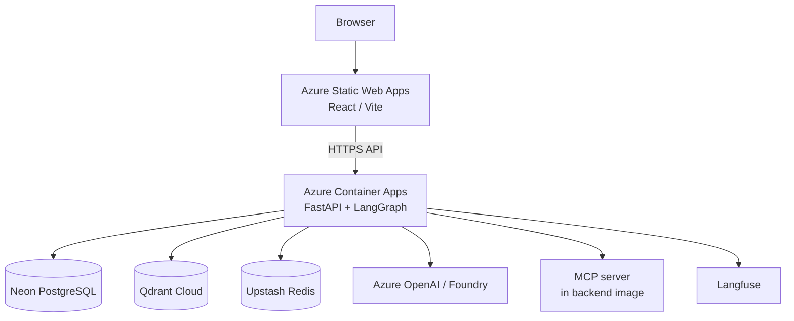

# Enterprise Agentic AI Platform

Production-oriented multi-tenant LLM, RAG, SQL, MCP and agentic AI playground.

Enterprise Agentic AI Platform is an engineering reference implementation and an
interactive portfolio demo. It shows how to build multi-tenant AI operations
workflows with advanced RAG, structured-data reasoning, MCP tools, human
approval, evaluation, observability, cost controls, and low-cost Azure
deployment — not a finished commercial SaaS product.

The public UI is the **Enterprise Agentic AI Playground**.

More detail: [`docs/project-plan.md`](docs/project-plan.md) ·
[`docs/architecture.md`](docs/architecture.md) ·
[`docs/phase-8b-runbook.md`](docs/phase-8b-runbook.md)

---

## Overview

The platform demonstrates:

- Multi-tenant knowledge RAG with dense + sparse hybrid retrieval and reranking
- LangGraph agent routing across knowledge, SQL, MCP tools, and unsupported paths
- Human-in-the-loop approval for sensitive write actions
- Evaluation/regression metrics and Langfuse observability
- A React playground for exploring tenant isolation, Compare Runs, and Execution Trace
- Cloud hosting on Azure Container Apps + Static Web Apps with free-tier data services

---

## Live Architecture



**Deployment path (not request-time):** GitHub Actions Backend CD validates the
backend, publishes an immutable image to **GHCR**, authenticates to Azure with
**OIDC** (no client secret), updates the existing Container Apps revision, then
smoke-tests `/health` and `/ready`. **Backend Full CD is COMPLETE** after a
successful production run. Frontend: GitHub Actions → Vite build → Azure Static
Web Apps.

Local development still uses Docker Compose for PostgreSQL, Redis, and Qdrant.

---

## Key Capabilities

| Area | Capability |
|------|------------|
| RAG | Dense + sparse hybrid retrieval, weighted RRF, cross-encoder reranking, Standard / Advanced modes |
| Agents | LangGraph router → knowledge / SQL / MCP tool / unsupported |
| SQL | LLM SQL + SQLGlot validation, SELECT-only, allowed tables, tenant bind param, read-only execution |
| MCP | `get_asset_status`, `get_maintenance_history`, `create_maintenance_ticket` |
| HITL | Write tools pause for human approval; approved actions persist tickets |
| Tenancy | PostgreSQL `tenant_id` + Qdrant payload filters |
| Cache / cost | Redis RAG cache, layered rate limits, public-demo budget guards |
| Checkpoints | PostgreSQL LangGraph checkpoints in production (`CHECKPOINT_BACKEND=postgres`) |
| Observability | Langfuse + in-app Execution Trace |
| Evaluation | Agent (24 cases) + retrieval (15 queries, k=3) golden sets |

---

## AI Playground

The React playground includes:

- **Playground** — chat, retrieval mode selector, tenant isolation demo prompts
- **Documents** — read-only inspect of seeded indexed documents/chunks
- **Operations** — assets, maintenance history, tickets
- **Compare Runs** — same question with Standard vs Advanced retrieval
- **Evaluation** — persisted regression metrics
- **System Status** — safe readiness view (no secrets/URLs)
- **Architecture** — system topology and RAG Pipeline Explorer

Tenant selector loads demo tenants from `GET /api/v1/demo/tenants`. The public
UI does **not** expose unrestricted document upload.

---

## RAG Architecture

Both **Standard** and **Advanced** modes use:

- Dense semantic retrieval (Azure OpenAI embeddings → Qdrant dense)
- Sparse / lexical retrieval (BM25 sparse vectors → Qdrant sparse)
- Hybrid fusion via weighted Reciprocal Rank Fusion (RRF)
- Tenant-scoped Qdrant `tenant_id` filtering
- Cross-encoder reranking (`ms-marco-MiniLM-L-6-v2`) + hybrid/reranker fusion

**Advanced** additionally:

- Query rewriting / multi-query generation
- Hybrid retrieval per rewritten query
- Fusion across query result sets
- Broader candidate coverage (usually higher latency / compute)

Reranking is **not** Advanced-only.

### Standard

```text
Query
  → Dense + Sparse Retrieval
  → Hybrid Fusion / RRF
  → Cross-Encoder Reranking
  → Context
  → LLM
```

### Advanced

```text
Query
  → Query Rewrite / Multi-Query
  → Dense + Sparse Retrieval per query
  → Multi-query Fusion
  → Cross-Encoder Reranking
  → Context
  → LLM
```

**Tradeoff:** Standard is optimized for lower retrieval overhead and speed.
Advanced increases retrieval depth and usually cost/latency. Advanced does
**not** always produce a better answer.

### Ingestion

```text
Document → parse → chunk → dense embeddings → sparse representation
  → Qdrant upsert (tenant_id payload) → indexed chunks
```

Document metadata is stored in PostgreSQL. After successful ingestion, the
tenant RAG knowledge version is incremented so Redis-cached answers for prior
knowledge are logically invalidated.

**Limitation:** original uploaded files use container/local filesystem storage
(`DOCUMENT_STORAGE_PATH`). This is **not** durable Azure Blob Storage.

---

## Agent Architecture

LangGraph nodes are routed workflow steps — not separate autonomous “agents.”

```text
START → Router
          ├── knowledge → RAG → Finalize → END
          ├── sql → SQL pipeline → Finalize → END
          ├── tool → MCP tool node
          │            ├── read → Finalize → END
          │            └── write → approval interrupt
          │                           ├── approve → approved action → Finalize → END
          │                           └── reject → Finalize → END
          └── unsupported → fallback → END
```

Production HITL checkpoints use **PostgreSQL** (`AsyncPostgresSaver` on Neon).
Local default remains `CHECKPOINT_BACKEND=memory`.

### SQL safety (implemented)

- LLM-generated SQL
- SQLGlot validation
- SELECT-only
- Allowed-table enforcement
- `:tenant_id` bind parameter + tenant scoping checks
- Read-only transaction / bounded result execution

PostgreSQL RLS / dedicated read-only DB role remain recommended
defense-in-depth improvements, not current product features.

### MCP tools

| Tool | Type | Notes |
|------|------|-------|
| `get_asset_status` | Read | Demo/simulated operational status via MCP |
| `get_maintenance_history` | Read | Demo/simulated history via MCP |
| `create_maintenance_ticket` | Write | Host-intercepted; HITL required; host persists to PostgreSQL |

The MCP stdio server ships in the backend container (`/app/mcp`). Tool data is
demo/synthetic — not a live CMMS/ERP integration.

---

## Multi-Tenant Isolation

Public demo tenants:

1. **Atlas Manufacturing**
2. **Borealis Cold Chain**
3. **Helios Energy Services**

Deliberate **E-100** isolation demo (same code, different grounded meaning):

| Tenant | E-100 meaning |
|--------|----------------|
| Atlas Manufacturing | Lubrication pressure below safe operating threshold |
| Borealis Cold Chain | Evaporator coil temperature sensor communication failure |
| Helios Energy Services | Power inverter communication timeout with site controller |

Answers come from **live tenant-scoped retrieval**, not frontend hardcoding.

---

## Execution Trace / AI Inspector

Assistant answers can expose a curated operational trace, including:

- Route and graph path
- Retrieval mode, strategy, query rewrites
- Candidate / context chunks and scores when present
- SQL metadata, MCP/tool metadata, HITL state
- Cache hit/miss, latency, token usage, estimated cost

This is **operational execution metadata**. It does **not** expose hidden
chain-of-thought, system prompts, secrets, or credentials.

Langfuse remains deeper server-side observability.

---

## Evaluation

Metrics are from a small curated regression dataset and are **not** claims of
universal production accuracy.

### Agent evaluation (`evals/results/agent_evaluation.json`)

24 cases:

| Metric | Value |
|--------|-------|
| Route accuracy | 1.0 |
| Approval accuracy | 1.0 |
| Execution success | 1.0 |
| End-to-end / workflow pass | 1.0 |

### Retrieval evaluation (`evals/results/retrieval_results.json`)

15 queries · k=3:

| Strategy | Recall@3 | MRR | nDCG@3 |
|----------|----------|-----|--------|
| Dense | 1.000 | 1.000 | 1.000 |
| Sparse | 0.933 | 0.900 | 0.909 |
| Hybrid | 1.000 | 1.000 | 0.995 |
| Hybrid + Reranker | 1.000 | 1.000 | 0.995 |
| Multi-Query Hybrid | 1.000 | 1.000 | 1.000 |
| Multi-Query + Reranker | 1.000 | 1.000 | 1.000 |

---

## Public Demo Safety / Cost Controls

Redis is used for:

- Tenant-aware RAG response cache (mode + knowledge-version aware)
- Client / tenant / global rate limiting
- Hard daily public-demo AI request ceiling
- Compare Runs stricter limit
- Approved write-action limiting

Redis is **not** used for primary data, vectors, or LangGraph checkpoints.

Layered protections (when configured for public demo):

1. RAG caching
2. Client rate limiting
3. Tenant rate limiting
4. Global AI request limit
5. Hard daily demo request ceiling
6. Maximum prompt length
7. Compare Runs stricter limit
8. Approved-write limiting
9. Container Apps `maxReplicas=1`
10. Container Apps `minReplicas=0` (scale-to-zero / cold starts)

Ordinary Redis cache/rate-limit failures **fail open** where configured.
The hard daily public-demo budget **fails closed** when `PUBLIC_DEMO_MODE=true`.

These controls reduce abuse risk; they do **not** guarantee zero cloud spend.
Azure subscription budgets/alerts are separate infrastructure controls.

---

## Tech Stack

**AI:** Azure OpenAI / Foundry · LangGraph · LangChain (where used) · MCP ·
sentence-transformers CrossEncoder

**Retrieval:** Qdrant · dense embeddings · BM25 sparse · hybrid RRF · reranking

**Backend:** Python 3.12 · FastAPI · Pydantic · SQLAlchemy · SQLGlot ·
PostgreSQL · Redis

**Frontend:** React · TypeScript · Vite

**Observability / eval:** Langfuse · golden datasets · Recall / MRR / nDCG ·
token / cost / latency instrumentation

**Cloud:** Azure Container Apps · Azure Static Web Apps · Neon · Qdrant Cloud ·
Upstash · GHCR · GitHub Actions

---

## Repository Structure

```text
enterprise-agentic-ai-platform/
├── backend/          # FastAPI app, agents, services, Alembic, tests
├── frontend/         # React/Vite playground
├── mcp/              # MCP stdio server (packaged into backend image)
├── evals/            # Agent + retrieval golden sets and results
├── data/demo_tenants/# Seeded tenant knowledge documents
├── docs/             # Architecture, project plan, Phase 8B runbook
├── .github/workflows/# CI, GHCR image publish, Static Web Apps deploy
├── docker-compose.yml
└── README.md
```

---

## Local Development

### 1. Infrastructure

```bash
docker compose up -d
```

Starts PostgreSQL (`5432`), Redis (`6379`), and Qdrant (`6333` / `6334`).

### 2. Backend

```bash
cd backend
uv sync --dev
cp .env.example .env.development
# fill Azure OpenAI / Langfuse as needed
uv run --env-file .env.development alembic upgrade head
uv run --env-file .env.development uvicorn app.main:app --reload
```

Demo seed (idempotent):

```bash
cd backend
PYTHONPATH=. uv run --env-file .env.development python scripts/seed_demo_playground.py
```

### 3. Frontend

```bash
cd frontend
cp .env.example .env.development
npm install
npm run dev
```

Useful URLs: API `http://127.0.0.1:8000` · Swagger `/docs` · UI
`http://localhost:5173` · Health `/health` · Ready `/ready`

Never commit real secrets. Do not mix localhost and cloud URLs in one env file.

---

## Environment Configuration

Backend settings read **process environment only** (explicit `--env-file`).

| File | Purpose |
|------|---------|
| `backend/.env.example` | Tracked placeholders |
| `backend/.env.development` | Local Docker services (gitignored) |
| `backend/.env.production` | Local testing against cloud services (gitignored) |
| `frontend/.env.example` | Tracked placeholders |
| `frontend/.env.development` / `.env.production` | Vite mode files (gitignored) |

Production values are injected as Container Apps / Static Web Apps
secrets/variables. See `backend/.env.example` for the full key list.

---

## Testing

```bash
cd backend && uv run pytest -q
cd backend && uv run ruff check app tests && uv run ruff format --check app tests
cd frontend && npm run lint && npm run build
```

Retrieval / agent evaluation runners live under `evals/` (see commands in
[`docs/architecture.md`](docs/architecture.md)).

---

## Deployment

**Backend**

```text
GitHub → Backend CD (validate → Docker build)
  → GHCR immutable tag :sha-<full-git-sha> (+ latest)
  → Azure OIDC (Environment: production)
  → az containerapp update (existing app only)
  → smoke /health + /ready
```

Status: **Backend Full CD COMPLETE** (validate → GHCR → OIDC → ACA →
`/health` → `/ready`). OIDC federated credentials must use GitHub’s immutable
subject form; see [`docs/phase-8b-runbook.md`](docs/phase-8b-runbook.md) and
`scripts/setup-azure-github-oidc.sh`.

**Frontend**

```text
GitHub → Azure Static Web Apps workflow → Vite build → Static Web Apps
```

Production topology: ACA backend · SWA frontend · Neon · Qdrant Cloud ·
Upstash · Azure OpenAI / Foundry · Langfuse.

---

## CI/CD

| Workflow | Behavior |
|----------|----------|
| `backend-ci.yml` | Ruff lint · Ruff format check · pytest · Docker **build-only** validation (PR/push) |
| `backend-cd.yml` | Production chain on `master` path changes / `workflow_dispatch`: validate → GHCR SHA image → Azure OIDC → ACA update → smoke tests |
| `backend-image.yml` | Ad-hoc GHCR publish only (`workflow_dispatch`) — does not race CD |
| `azure-static-web-apps-*.yml` | Build/deploy frontend to **Static Web Apps** |

**Important:** Backend CD updates Container Apps on backend-relevant `master`
pushes (and `workflow_dispatch`). Entra must trust GitHub’s immutable OIDC
subject (`repo:owner@OWNER_ID/repo@REPO_ID:environment:production`).

---

## Current Status

| Area | Status |
|------|--------|
| Sprints 0–7 | Complete |
| Sprint 8 — Azure Deployment, Public Playground & Production Hardening | **COMPLETE** |
| Backend Full CD | **COMPLETE** (validate → GHCR SHA → OIDC → ACA → `/health` → `/ready`) |
| Cloud hosting | ACA · SWA · Neon · Qdrant Cloud · Upstash · Postgres checkpoints · public playground |

Core platform feature scope and Sprint 8 deployment hardening are complete.
Near-term priority is demo video / screenshots / portfolio polish — not new
sprint implementation.

---

## Roadmap

1. Demo video / screenshots / portfolio polish (first)
2. Sprint 9 multimodal manufacturing use case (later)
3. Sprint 10 portfolio / evidence polish as appropriate
4. Sprint 11 repository / code-review intelligence agent
5. Optional: Azure Blob durable document storage

---

## Important Limitations

- Public demo uses seeded **synthetic** enterprise data
- MCP integrations are **demo/simulated**, not a real CMMS/ERP
- Evaluation datasets are intentionally **small**
- Uploaded-file storage is **not** durable Blob Storage
- No full public authentication / RBAC product layer
- ACA `minReplicas=0` introduces **cold starts**
- Cost controls reduce risk; they do not guarantee zero spend

---

## Design Principles

- Explicit tenant boundaries at every data plane
- Measurable retrieval and agent quality
- Human approval for sensitive writes
- PostgreSQL as relational source of truth; Qdrant as retrieval index
- Secrets out of Git; CI green before advancing

## License

No license has been selected yet.
