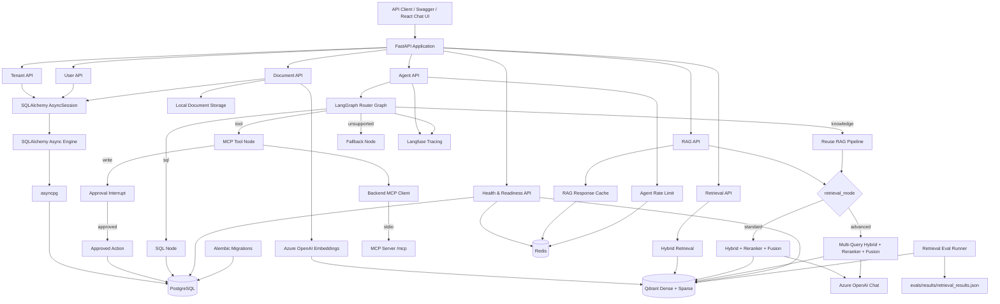
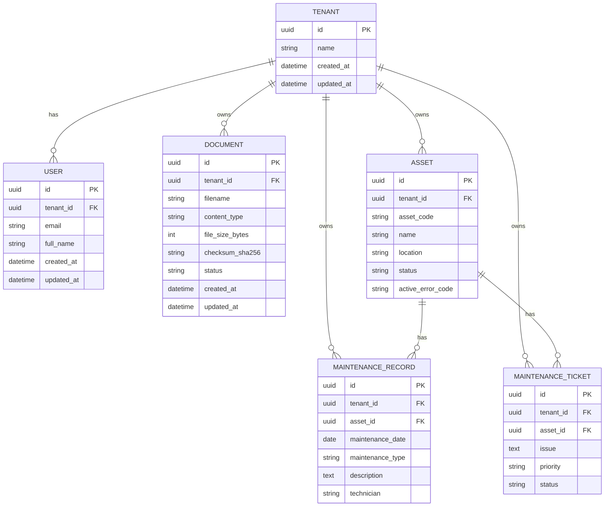
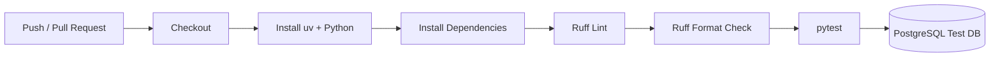
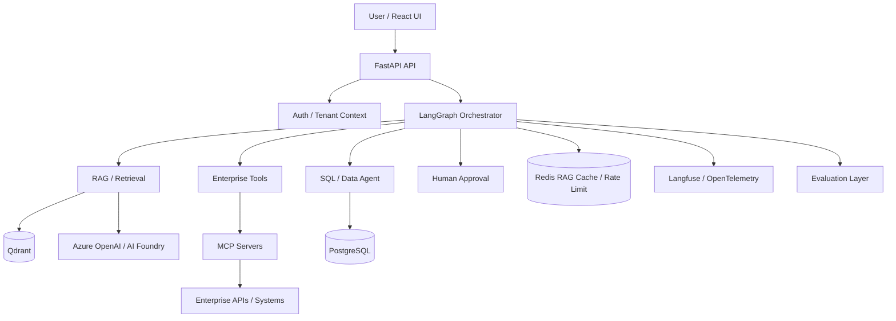

# Architecture

## Current Architecture — Sprints 0–8

The platform provides a multi-tenant FastAPI backend with document ingestion,
hybrid retrieval, reranking, Standard/Advanced multi-query RAG, retrieval and
agent evaluation, a **router-based LangGraph agent** (knowledge / SQL / MCP /
unsupported), **HITL approval** for write actions, **Langfuse tracing**, a
**React Enterprise Agentic AI Playground**, and **low-cost Azure cloud hosting**
(Static Web Apps + Container Apps, Neon, Qdrant Cloud, Upstash).

JWT/RBAC as a public product layer, durable Blob document storage, OpenTelemetry
beyond Langfuse, and **full backend Container Apps CD automation** remain
planned. Production checkpoints use PostgreSQL when
`CHECKPOINT_BACKEND=postgres`.



## Request Path

A normal database-backed API request currently follows this path:

```text
HTTP Request
    ↓
FastAPI Route
    ↓
Pydantic Validation
    ↓
FastAPI Dependency Injection
    ↓
SQLAlchemy AsyncSession
    ↓
SQLAlchemy Async Engine
    ↓
asyncpg
    ↓
PostgreSQL
```

`AsyncSession` is created per request through the `get_db` FastAPI dependency.

## RAG Retrieval Paths

### Standard (default)

```text
Query
  ↓
Dense + Sparse Hybrid Retrieval
  ↓
Weighted RRF
  ↓
CrossEncoder Reranker
  ↓
Final Rank Fusion
  ↓
Top-K Chunks
  ↓
Azure OpenAI Chat
  ↓
Grounded Answer + Sources
```

### Advanced

```text
Query
  ↓
Query Expansion
  ↓
Multi-Query Hybrid Retrieval
  ↓
Multi-Query RRF + Deduplication
  ↓
CrossEncoder (original user query)
  ↓
Final Rank Fusion
  ↓
Top-K Chunks
  ↓
Azure OpenAI Chat
  ↓
Grounded Answer + Sources
```

CrossEncoder always receives the original user query. Expansion queries are used
only for candidate retrieval.

## Agent Orchestration (Sprint 3–5)

The agent layer is a **router-based LangGraph graph**, not a full multi-agent
supervisor. RAG, SQL, and MCP tools are capabilities; MCP does not expose REST
endpoints.

### Implemented graph

```text
START
  ↓
LLM Router
  ├── knowledge → RAG Node → Finalize → END
  ├── sql → SQL Node → Finalize → END
  ├── tool → MCP Tool Node
  │            ├── (read tool) → Finalize → END
  │            └── (write tool) → Approval
  │                                 ├── approved → Approved Action → Finalize → END
  │                                 └── rejected → Finalize → END
  └── unsupported → Fallback → END
```

### Routing responsibilities

1. The **LLM Router** selects the capability category:
   - `knowledge` — enterprise documents / knowledge base
   - `sql` — structured operational data in PostgreSQL
   - `tool` — MCP tools / enterprise actions (writes require HITL)
   - `unsupported` — capabilities not currently available
2. On the `tool` path, the **MCP Tool Node's LLM** selects the specific MCP tool.
3. On the `sql` path, the SQL node generates, validates, and executes read-only SQL.
4. **MCP itself does not create REST endpoints.** Agent HTTP surfaces are:
   - `POST /api/v1/tenants/{tenant_id}/agent`
   - `POST /api/v1/tenants/{tenant_id}/agent/{thread_id}/approval`

### Shared state

```text
AgentState
├── tenant_id
├── query
├── retrieval_mode      # standard | advanced
├── route               # knowledge | sql | tool | unsupported
├── requires_approval
├── pending_action
├── approval_granted
├── action_result
├── generated_sql
├── rag_answer
├── tool_answer
├── sql_answer
└── final_answer
```

### Agent request path

```text
POST /api/v1/tenants/{tenant_id}/agent
  ↓
Validate tenant + payload
  ↓
thread_id = new UUID
  ↓
agent_graph.ainvoke(..., config={configurable: {thread_id}})
  ↓
├── __interrupt__ → { thread_id, status=approval_required, route, answer, pending_action }
└── completed     → { thread_id, status=completed, route, answer }
```

Approval resume:

```text
POST /api/v1/tenants/{tenant_id}/agent/{thread_id}/approval
  body: { "approved": true|false }
  ↓
Verify checkpoint exists, tenant matches, next == approval
  ↓
agent_graph.ainvoke(Command(resume={"approved": ...}), config={thread_id})
  ↓
{ thread_id, status=completed, route, answer }
```

Failure / conflict handling:

- invalid `retrieval_mode` → HTTP 422
- missing / wrong-tenant thread → HTTP 404
- thread not waiting for approval → HTTP 409
- graph execution exception → HTTP 503 (`Agent execution failed.`)

### Checkpoints

Local development defaults to LangGraph **`InMemorySaver`**
(`CHECKPOINT_BACKEND=memory`).

Production / cloud uses **`AsyncPostgresSaver`** against the application
PostgreSQL database (`CHECKPOINT_BACKEND=postgres`, same Neon `DATABASE_URL`).
Checkpoint tables are created on startup via `AsyncPostgresSaver.setup()`.

## Observability (Sprint 6)

### Langfuse integration

Agent API runs and evaluation invocations attach a Langfuse
`CallbackHandler` to the LangGraph config. This traces:

- The top-level LangGraph run (`enterprise-agent`, `enterprise-agent-approval`, `agent-evaluation`)
- Nested LLM spans inside router, RAG, SQL generation, SQL answer synthesis, and MCP tool nodes

Trace metadata includes:

| Field | When attached |
|-------|----------------|
| `tenant_id` | Agent request and approval resume |
| `thread_id` | Agent request and approval resume |
| `retrieval_mode` | Initial agent request |
| `approval` | Approval resume (`true` / `false`) |

Langfuse automatically records **latency**, **token usage**, **model**, and
**cost** for nested LLM calls — no manual instrumentation per span.

Configuration via environment variables (`LANGFUSE_PUBLIC_KEY`, `LANGFUSE_SECRET_KEY`,
`LANGFUSE_BASE_URL`) — see `backend/.env.example`.

### Failure visibility

Langfuse traces make failures inspectable across agent paths:

- **SQL guardrail failures** — SQLGlot validation rejects unsafe queries before execution
- **LLM errors** — model invocation or structured-output failures inside graph nodes
- **MCP / tool failures** — read-tool execution errors from the MCP client
- **HITL flows** — interrupt pauses and approval resume spans show write-action lifecycle

API consumers may only see HTTP 503 for graph failures; Langfuse provides the
nested span context for debugging.

## Agent Evaluation (Sprint 6)

### Golden dataset

`evals/agent/golden_dataset.json` — **24 cases**:

| Category | Cases | Checks |
|----------|-------|--------|
| knowledge | 6 | RAG route, no approval |
| sql | 6 | SQL route, no approval |
| tool (read) | 2 | MCP route, no approval |
| tool (write / HITL) | 4 | MCP route, approval interrupt |
| unsupported | 6 | Fallback route, no approval |

### Evaluation runners

```text
evals/agent/golden_dataset.json
        ↓
evals/agent/run_router_evaluation.py     → router accuracy (stdout)
        ↓
evals/agent/run_agent_evaluation.py      → full graph + Langfuse traces
        ↓
evals/results/agent_evaluation.json      → persisted metrics + per-case results
```

End-to-end evaluation checks:

- `expected_route` vs actual route
- `expected_approval` vs actual interrupt
- answer present (non-empty)

### Current benchmark (regression artifact)

| Metric | Result |
|--------|--------|
| Route accuracy | 24/24 |
| Approval accuracy | 24/24 |
| Execution success | 24/24 |
| Workflow regression pass rate | 24/24 |

These results are from a **small 24-case golden dataset** used for local
regression — they are **not** production-wide accuracy, answer-quality, or
reliability claims.

## React Chat Frontend (Sprint 7)

Location: `/frontend` (React + TypeScript + Vite)

```text
Browser (localhost:5173)
  ↓
React chat UI
  ↓
POST /api/v1/tenants/{tenant_id}/agent
  ↓
LangGraph backend (unchanged)
  ↓
Response → message + route badge + optional approval card
```

Features:

- In-memory conversation state (lost on refresh)
- Standard / Advanced retrieval mode selector → `retrieval_mode`
- Route badges: Knowledge / Data / Tool / Unsupported
- HITL approval card for write actions (approve/reject via backend API only)
- Collapsible Details panel (route, retrieval mode, thread ID)
- Loading and error states

Configuration:

- `frontend/.env.example` — placeholders; Vite uses `.env.development` /
  `.env.production` (gitignored) for `npm run dev` / `npm run build`
- Backend — `backend/.env.example` plus explicit
  `uv run --env-file .env.development|production ...` (no shared `.env` auto-load)
- Backend CORS — `CORS_ORIGINS` in the selected env file

Known limitation: the Agent API does **not** expose RAG citations/sources, so
the frontend does not render a Sources section.

## SQL Agent (Sprint 5)

### Natural language → SQL pipeline

```text
User question
  ↓
generate_sql()          # LLM structured SELECT
  ↓
validate_readonly_sql() # SQLGlot
  ↓
SET TRANSACTION READ ONLY
  ↓
execute with :tenant_id + outer LIMIT
  ↓
LLM answer grounded on returned rows
```

### SQLGlot validation rules

- Exactly one statement
- `SELECT` only
- Tables limited to `assets`, `maintenance_records`, `maintenance_tickets`
- Required `WHERE` with `:tenant_id` bind parameter
- Every table/alias in joins must be tenant-scoped
- `OR` in `WHERE` disallowed (tenant-filter bypass prevention)
- Host applies an outer `LIMIT` (default 100)

### PostgreSQL read-only transaction

Before executing generated SQL, the session runs:

```sql
SET TRANSACTION READ ONLY
```

This is a second enforcement layer: even if application validation were bypassed,
writes in that transaction fail at the database.

## HITL & Approved Writes (Sprint 5)

### Host interception of MCP write tools

Sensitive tools such as `create_maintenance_ticket` are listed in
`APPROVAL_REQUIRED_TOOLS` inside `mcp_tool_node`. When selected:

1. The host **does not** call MCP `call_tool` for that write.
2. State is set with `requires_approval=True` and `pending_action`.
3. The graph routes to the approval node, which calls LangGraph `interrupt(...)`.

The MCP server’s `create_maintenance_ticket` raises if invoked directly, so the
MCP path **cannot bypass** host approval. Persistence happens only in the host
via `approved_action_service` → `maintenance_ticket_service` after approval.

### Approved action execution

On `Command(resume={"approved": true})`:

```text
approved_action_node
  ↓
execute_approved_action(tenant_id, pending_action)
  ↓
create_maintenance_ticket(...) → PostgreSQL INSERT (commit)
  ↓
tool_answer confirms ticket id / priority → Finalize
```

On rejection, the graph finalizes with a rejection message and **no** DB write.

## MCP & Enterprise Tool Integration (Sprint 4–5)

### Separate MCP server project

The MCP server lives under `/mcp` as its own `uv` project
(`enterprise-maintenance-mcp`). It is not part of the FastAPI process.

Current local integration uses **stdio** transport:

```text
Backend MCP client
  ↓
stdio (uv run python server.py, cwd=/mcp)
  ↓
MCP server process
```

### Backend MCP client

`backend/app/services/mcp_client.py`:

- Opens a stdio session to the MCP server
- Discovers tools via `list_tools()`
- Executes tools via `call_tool(name, arguments)` (read tools only in practice)
- Consumes structured tool outputs (`structured_content`)

### Read tool-calling loop

```text
User request (tool route, non-write)
  ↓
list_tools() → bind MCP schemas to chat model
  ↓
LLM tool selection
  ↓
call_tool() → MCP execution
  ↓
ToolMessage (structured result as JSON)
  ↓
LLM final answer → tool_answer → Finalize
```

### Implemented MCP tools

| Tool | Behavior |
|------|----------|
| `get_asset_status` | Demo operational status via MCP (in-memory server data) |
| `get_maintenance_history` | Demo maintenance history via MCP (in-memory server data) |
| `create_maintenance_ticket` | Schema advertised for LLM selection; **host-intercepted**; after HITL approval, host persists a real ticket in PostgreSQL. MCP cannot execute the write. |

### What is intentionally not implemented yet

- JWT / RBAC / authenticated public product layer
- Durable Azure Blob storage for uploaded original files
- Full backend Container Apps CD (Azure OIDC → revision); GHCR publish exists
- OpenTelemetry (Langfuse is implemented; OTel remains planned)
- CI-enforced evaluation regression gates
- Real external enterprise APIs beyond local PostgreSQL + MCP demo data
- Multi-agent supervisor orchestration
- Automatic retry policies

## Multi-Tenant Data Model



User email uniqueness is tenant-scoped:

```text
UNIQUE (tenant_id, email)
```

Asset codes are unique per tenant:

```text
UNIQUE (tenant_id, asset_code)
```

## Tenant Isolation

Documents, retrieval, RAG, SQL queries, and ticket writes are tenant-scoped.

- Qdrant queries always include a `tenant_id` payload filter
- SQL agent requires `:tenant_id` filters validated by SQLGlot
- Ticket creation resolves assets and inserts tickets under the request `tenant_id`
- Approval resume verifies the checkpointed `tenant_id` matches the URL tenant

A request for Tenant A must never return Tenant B chunks or operational rows.

## Infrastructure

Local infrastructure is orchestrated through Docker Compose.

### PostgreSQL

Current responsibility:

- Tenant / user / document metadata
- Operational assets, maintenance records, and tickets
- Relational source of truth for approved write actions

### Redis

Used for short-lived, tenant-aware application optimizations and public-demo
cost protection:

- RAG response caching (knowledge answers only; TTL ≈ 5 minutes)
- Per-tenant agent rate limiting (`POST .../agent`)
- Per-client (hashed IP) rate limiting
- Global hourly AI execution ceiling
- Hard daily demo AI request budget (`demo_budget:ai_requests:{UTC_DATE}`)
- Compare Runs stricter limit
- Approved write-action rate limiting

Redis is **not** used for:

- Primary application data
- LangGraph persistent checkpoints (PostgreSQL / Neon)
- Maintenance tickets
- Vector storage (Qdrant)

Cache keys are versioned per tenant (`rag_version:{tenant_id}`). Successful
document ingestion increments the version so prior RAG cache entries become
logically stale without SCAN/delete-by-prefix.

**Failure policy:**

- Ordinary rate limits and RAG cache **fail open** when Redis is unavailable
  (local / non-demo usability).
- When `PUBLIC_DEMO_MODE=true`, the hard daily AI budget **fails closed** so a
  Redis outage cannot remove the final cost ceiling.

Application-level controls reduce abuse risk but are not a substitute for Azure
subscription budgets/alerts.

### Qdrant

Current responsibility:

- Dense embeddings
- Sparse BM25 vectors
- Tenant-scoped hybrid retrieval
- Metadata filtering

Qdrant remains a retrieval index, not the primary application database.

### MCP server (`/mcp`)

Current responsibility:

- Local stdio MCP server for maintenance tool schemas / read demos
- Write tools are host-gated; MCP does not persist tickets

## Health Model

```text
GET /health
GET /ready
```

`/health` verifies that the application process is running (liveness). It does
**not** require Azure OpenAI or Langfuse.

`/ready` verifies infrastructure dependencies:

```text
PostgreSQL  → hard (required)
Qdrant      → hard (required)
Redis       → soft / degraded-mode (RAG cache + rate limiting)
```

When PostgreSQL and Qdrant are healthy but Redis is down (and `REDIS_ENABLED`),
`/ready` still returns `status: "ready"` with `"degraded": true` and
`services.redis: false`. Redis failure does not make the app unready because
caching and rate limiting fail open.

Example (Redis unavailable):

```json
{
  "status": "ready",
  "services": {
    "postgres": true,
    "qdrant": true,
    "redis": false
  },
  "degraded": true
}
```

These endpoints are suitable for container platform probes. Azure OpenAI and
Langfuse remain optional for process health.

### Production topology (Phase 8B target)

```text
FastAPI / LangGraph
├── Neon PostgreSQL
│   ├── application data
│   └── LangGraph checkpoints
├── Qdrant Cloud
│   └── vector retrieval
├── Redis / Upstash
│   ├── RAG cache
│   ├── tenant + client rate limiting
│   ├── global hourly AI ceiling
│   └── hard daily demo budget
└── Azure OpenAI / Foundry
```

## Production Packaging (Sprint 8 Phase 8A)

Backend image (repository-root build context packages MCP in the same container):

```bash
docker build -f backend/Dockerfile -t enterprise-agentic-ai-backend .
```

- Multi-stage build with `uv` and `uv.lock` (production deps only)
- Linux resolves **CPU-only PyTorch** via the official PyTorch CPU index
  (macOS local development continues to use PyPI torch wheels)
- MCP stdio server is copied to `/app/mcp` and launched with `uv run`
- Runs as non-root user; binds `0.0.0.0:${PORT:-8000}`
- No `.env` or secrets baked into the image
- Runtime configuration via environment variables (`DATABASE_URL`, `REDIS_URL`,
  `QDRANT_URL`, `QDRANT_API_KEY`, `CHECKPOINT_BACKEND`, Azure OpenAI, Langfuse,
  `CORS_ORIGINS`, optional `MCP_SERVER_DIR`)
- Local/dev machines use explicit env files:
  `uv run --env-file .env.development|production ...` (no silent shared `.env`)
- Frontend uses Vite mode files (`.env.development` / `.env.production`) and
  build-time `VITE_API_BASE_URL` (no frontend Docker image)
- CI: Ruff + pytest; Docker build validation; GHCR image publish on backend
  path changes; Static Web Apps frontend deploy workflow

### Azure status

Application hosting and free-tier data services are in use for the public
playground:

| Layer | Current |
|-------|---------|
| Frontend | Azure Static Web Apps |
| Backend | Azure Container Apps Consumption (`minReplicas=0`, port 8000) |
| PostgreSQL | Neon Free (`DATABASE_URL`, `ssl=require`) |
| HITL checkpoints | Same Neon DB via `CHECKPOINT_BACKEND=postgres` |
| Vectors | Qdrant Cloud Free (`QDRANT_URL` + `QDRANT_API_KEY`) |
| Redis | Upstash Free (`REDIS_URL=rediss://...`) — RAG cache + rate / demo budget guards |
| LLM | Existing Azure AI Foundry / Azure OpenAI |
| Observability | Existing Langfuse (+ App Insights / Log Analytics where used) |
| Registry | GHCR (`backend-image.yml`) |

Local default remains `CHECKPOINT_BACKEND=memory` (`InMemorySaver`).
Production selects PostgreSQL-backed LangGraph checkpoints without a second
database. See `docs/phase-8b-runbook.md` for env and operational steps.

**Remaining:** backend full CD (GHCR → Azure OIDC → Container Apps revision).
Frontend Static Web Apps deploy workflow already exists. Latest local frontend
UX polish must be committed before it is live on SWA.

After Neon `DATABASE_URL` is configured:

```bash
cd backend && uv run --env-file .env.production alembic upgrade head
```

Checkpoint tables are created on startup by `AsyncPostgresSaver.setup()` when
`CHECKPOINT_BACKEND=postgres`.

### Document storage limitation

`DOCUMENT_STORAGE_PATH` (default `/app/storage/documents` in the container) is
local filesystem storage suitable for development / demo seeding. It is **not**
durable across container restarts/redeploys. Preferred follow-up: Azure Blob
Storage for uploaded originals.

### Phase 8B cost constraint

Target fixed monthly infrastructure cost ≈ $0 for this portfolio/demo:

- Azure Static Web Apps Free
- Azure Container Apps Consumption with `minReplicas = 0`
- Existing Azure AI Foundry / Azure OpenAI
- Existing Application Insights / Log Analytics where useful
- Neon Free PostgreSQL (not paid Azure PostgreSQL)
- Qdrant Cloud Free
- Upstash Redis Free

Avoid AKS, GPU compute, always-on Container Apps, paid Azure PostgreSQL,
Azure Managed Redis, premium networking, and unnecessary gateways.

## Database Migrations

Schema evolution is managed with Alembic.

Current migration history includes:

```text
create tenants table
        ↓
create users table
        ↓
create documents table
        ↓
add operational maintenance tables
  (assets, maintenance_records, maintenance_tickets)
```

## Testing Architecture

Integration tests use a dedicated PostgreSQL database:

```text
agentic_ai_test
```

21 tests currently pass (`cd backend && uv run pytest -q`).

Retrieval evaluation is separate from unit/integration tests:

```text
evals/datasets/retrieval_golden.jsonl
        ↓
evals/retrieval/run_evaluation.py
        ↓
evals/results/retrieval_results.json
```

Agent evaluation (Sprint 6):

```text
evals/agent/golden_dataset.json
        ↓
evals/agent/run_router_evaluation.py
evals/agent/run_agent_evaluation.py
        ↓
evals/results/agent_evaluation.json
```

The retrieval golden set (15 queries) and agent golden set (24 cases) are
intentionally small regression artifacts — not large-scale production benchmarks.

Critical agent API tests cover graph result mapping (including approval-required
tool paths), invalid `retrieval_mode` validation (422), and controlled graph
failure handling (503).

## CI Architecture

GitHub Actions executes the backend quality gate on pushes and pull requests.



## Current Technology Stack

### Application

- Python 3.12
- FastAPI
- Pydantic
- LangChain text splitters / Azure OpenAI integrations
- LangGraph (router + interrupt / Command resume)
- MCP Python SDK (stdio client + separate `/mcp` server)
- SQLGlot
- Langfuse (LangGraph + nested LLM tracing)

### Persistence & Retrieval

- SQLAlchemy 2 Async
- asyncpg
- PostgreSQL
- Alembic
- Qdrant (dense + sparse)
- FastEmbed BM25
- CrossEncoder reranker

### Infrastructure

- Docker Compose (local)
- Redis / Upstash
- Azure OpenAI / Foundry
- Local MCP server under `/mcp` (stdio; packaged in backend image)
- LangGraph checkpoints: `InMemorySaver` (dev) / Postgres saver (production)
- Langfuse (local / cloud tracing)
- Azure Container Apps + Static Web Apps + GHCR

### Quality

- pytest
- pytest-asyncio
- HTTPX
- Ruff
- GitHub Actions
- Retrieval evaluation under `evals/`
- Agent evaluation under `evals/agent/`
- React + TypeScript chat UI under `frontend/`

## Planned Target Architecture

The following remains the longer-term direction. Sprints 3–7 deliver the
router-based LangGraph entrypoint with RAG, SQL, MCP tools, HITL writes to
local PostgreSQL, Langfuse tracing, agent evaluation, and a React chat UI.
Persistent production checkpoints, JWT/RBAC, application-wide OpenTelemetry,
cloud deployment, and CI regression gates are **not** current implementation:



Planned components such as JWT/RBAC, persistent checkpointers, React UI, cloud
deployment, and supervisor-style agent expansion will only be marked as
implemented after their corresponding sprint is completed.

## Architecture Principles

The project is designed around:

- Tenant isolation
- Explicit data ownership
- Async I/O
- Schema migrations
- Testability
- CI enforcement
- Measurable retrieval quality
- Controlled SQL execution (SQLGlot + read-only transactions)
- Controlled tool execution via MCP with host-gated writes
- Human approval for sensitive actions
- Langfuse observability for agent debugging
- Reproducible local environments
