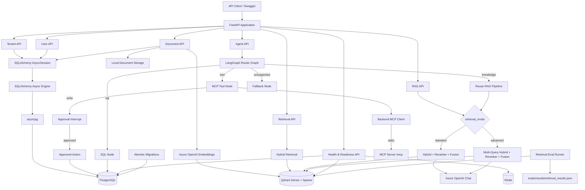
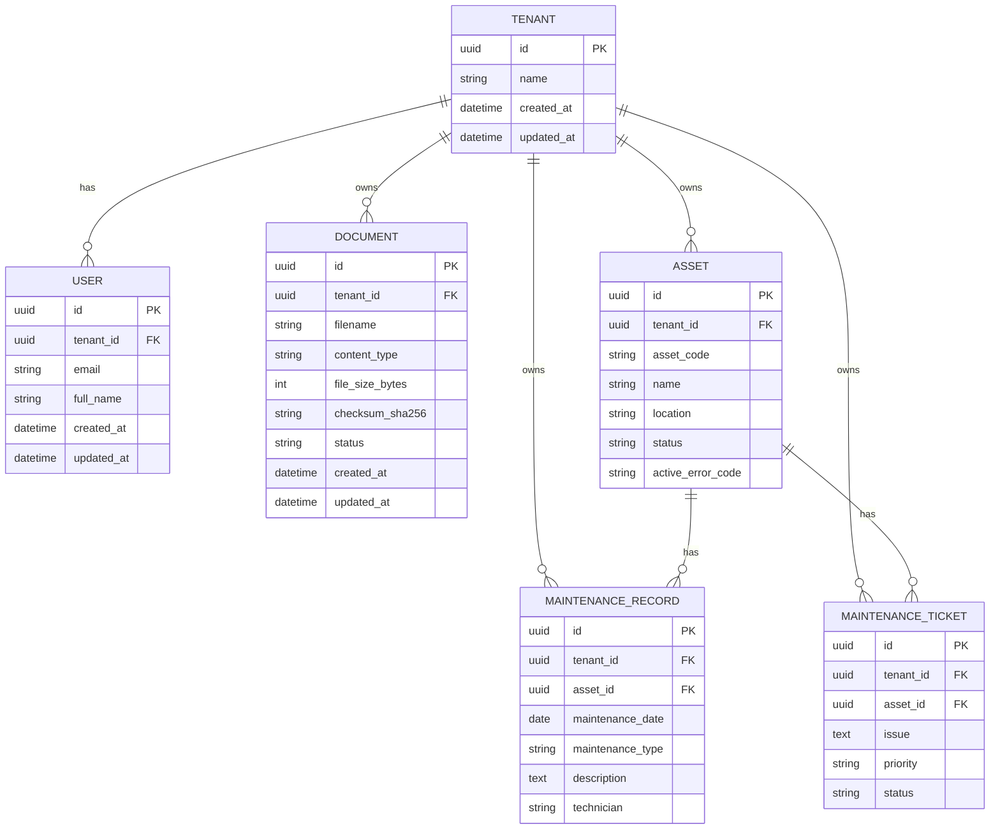
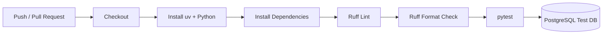
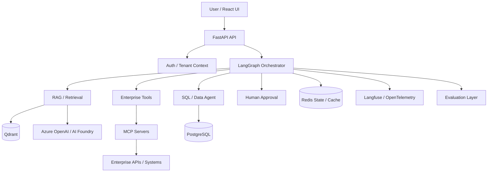

# Architecture

## Current Architecture — Sprint 0–5

The platform currently provides a multi-tenant FastAPI backend with document
ingestion, hybrid retrieval, reranking, multi-query RAG modes, retrieval
evaluation, a **router-based LangGraph agent** with knowledge (RAG), SQL, and
MCP tool routes, plus **HITL approval** for write actions that persist
maintenance tickets to PostgreSQL.

JWT/RBAC, persistent production checkpoint storage, cloud deployment, and
Langfuse remain planned — production deployment is **not** complete.



## Request Path

A normal database-backed API request currently follows this path:

```text
HTTP Request
    ↓
FastAPI Route
    ↓
Pydantic Validation
    ↓
FastAPI Dependency Injection
    ↓
SQLAlchemy AsyncSession
    ↓
SQLAlchemy Async Engine
    ↓
asyncpg
    ↓
PostgreSQL
```

`AsyncSession` is created per request through the `get_db` FastAPI dependency.

## RAG Retrieval Paths

### Standard (default)

```text
Query
  ↓
Dense + Sparse Hybrid Retrieval
  ↓
Weighted RRF
  ↓
CrossEncoder Reranker
  ↓
Final Rank Fusion
  ↓
Top-K Chunks
  ↓
Azure OpenAI Chat
  ↓
Grounded Answer + Sources
```

### Advanced

```text
Query
  ↓
Query Expansion
  ↓
Multi-Query Hybrid Retrieval
  ↓
Multi-Query RRF + Deduplication
  ↓
CrossEncoder (original user query)
  ↓
Final Rank Fusion
  ↓
Top-K Chunks
  ↓
Azure OpenAI Chat
  ↓
Grounded Answer + Sources
```

CrossEncoder always receives the original user query. Expansion queries are used
only for candidate retrieval.

## Agent Orchestration (Sprint 3–5)

The agent layer is a **router-based LangGraph graph**, not a full multi-agent
supervisor. RAG, SQL, and MCP tools are capabilities; MCP does not expose REST
endpoints.

### Implemented graph

```text
START
  ↓
LLM Router
  ├── knowledge → RAG Node → Finalize → END
  ├── sql → SQL Node → Finalize → END
  ├── tool → MCP Tool Node
  │            ├── (read tool) → Finalize → END
  │            └── (write tool) → Approval
  │                                 ├── approved → Approved Action → Finalize → END
  │                                 └── rejected → Finalize → END
  └── unsupported → Fallback → END
```

### Routing responsibilities

1. The **LLM Router** selects the capability category:
   - `knowledge` — enterprise documents / knowledge base
   - `sql` — structured operational data in PostgreSQL
   - `tool` — MCP tools / enterprise actions (writes require HITL)
   - `unsupported` — capabilities not currently available
2. On the `tool` path, the **MCP Tool Node's LLM** selects the specific MCP tool.
3. On the `sql` path, the SQL node generates, validates, and executes read-only SQL.
4. **MCP itself does not create REST endpoints.** Agent HTTP surfaces are:
   - `POST /api/v1/tenants/{tenant_id}/agent`
   - `POST /api/v1/tenants/{tenant_id}/agent/{thread_id}/approval`

### Shared state

```text
AgentState
├── tenant_id
├── query
├── retrieval_mode      # standard | advanced
├── route               # knowledge | sql | tool | unsupported
├── requires_approval
├── pending_action
├── approval_granted
├── action_result
├── generated_sql
├── rag_answer
├── tool_answer
├── sql_answer
└── final_answer
```

### Agent request path

```text
POST /api/v1/tenants/{tenant_id}/agent
  ↓
Validate tenant + payload
  ↓
thread_id = new UUID
  ↓
agent_graph.ainvoke(..., config={configurable: {thread_id}})
  ↓
├── __interrupt__ → { thread_id, status=approval_required, route, answer, pending_action }
└── completed     → { thread_id, status=completed, route, answer }
```

Approval resume:

```text
POST /api/v1/tenants/{tenant_id}/agent/{thread_id}/approval
  body: { "approved": true|false }
  ↓
Verify checkpoint exists, tenant matches, next == approval
  ↓
agent_graph.ainvoke(Command(resume={"approved": ...}), config={thread_id})
  ↓
{ thread_id, status=completed, route, answer }
```

Failure / conflict handling:

- invalid `retrieval_mode` → HTTP 422
- missing / wrong-tenant thread → HTTP 404
- thread not waiting for approval → HTTP 409
- graph execution exception → HTTP 503 (`Agent execution failed.`)

### Checkpoints

The compiled graph uses LangGraph **`InMemorySaver`** for local development.

This is **not** production-ready: process restarts lose paused approval threads.
Replace with persistent checkpoint storage (e.g. Postgres or Redis-backed
checkpointer) before production deployment.

## SQL Agent (Sprint 5)

### Natural language → SQL pipeline

```text
User question
  ↓
generate_sql()          # LLM structured SELECT
  ↓
validate_readonly_sql() # SQLGlot
  ↓
SET TRANSACTION READ ONLY
  ↓
execute with :tenant_id + outer LIMIT
  ↓
LLM answer grounded on returned rows
```

### SQLGlot validation rules

- Exactly one statement
- `SELECT` only
- Tables limited to `assets`, `maintenance_records`, `maintenance_tickets`
- Required `WHERE` with `:tenant_id` bind parameter
- Every table/alias in joins must be tenant-scoped
- `OR` in `WHERE` disallowed (tenant-filter bypass prevention)
- Host applies an outer `LIMIT` (default 100)

### PostgreSQL read-only transaction

Before executing generated SQL, the session runs:

```sql
SET TRANSACTION READ ONLY
```

This is a second enforcement layer: even if application validation were bypassed,
writes in that transaction fail at the database.

## HITL & Approved Writes (Sprint 5)

### Host interception of MCP write tools

Sensitive tools such as `create_maintenance_ticket` are listed in
`APPROVAL_REQUIRED_TOOLS` inside `mcp_tool_node`. When selected:

1. The host **does not** call MCP `call_tool` for that write.
2. State is set with `requires_approval=True` and `pending_action`.
3. The graph routes to the approval node, which calls LangGraph `interrupt(...)`.

The MCP server’s `create_maintenance_ticket` raises if invoked directly, so the
MCP path **cannot bypass** host approval. Persistence happens only in the host
via `approved_action_service` → `maintenance_ticket_service` after approval.

### Approved action execution

On `Command(resume={"approved": true})`:

```text
approved_action_node
  ↓
execute_approved_action(tenant_id, pending_action)
  ↓
create_maintenance_ticket(...) → PostgreSQL INSERT (commit)
  ↓
tool_answer confirms ticket id / priority → Finalize
```

On rejection, the graph finalizes with a rejection message and **no** DB write.

## MCP & Enterprise Tool Integration (Sprint 4–5)

### Separate MCP server project

The MCP server lives under `/mcp` as its own `uv` project
(`enterprise-maintenance-mcp`). It is not part of the FastAPI process.

Current local integration uses **stdio** transport:

```text
Backend MCP client
  ↓
stdio (uv run python server.py, cwd=/mcp)
  ↓
MCP server process
```

### Backend MCP client

`backend/app/services/mcp_client.py`:

- Opens a stdio session to the MCP server
- Discovers tools via `list_tools()`
- Executes tools via `call_tool(name, arguments)` (read tools only in practice)
- Consumes structured tool outputs (`structured_content`)

### Read tool-calling loop

```text
User request (tool route, non-write)
  ↓
list_tools() → bind MCP schemas to chat model
  ↓
LLM tool selection
  ↓
call_tool() → MCP execution
  ↓
ToolMessage (structured result as JSON)
  ↓
LLM final answer → tool_answer → Finalize
```

### Implemented MCP tools

| Tool | Behavior |
|------|----------|
| `get_asset_status` | Demo operational status via MCP (in-memory server data) |
| `get_maintenance_history` | Demo maintenance history via MCP (in-memory server data) |
| `create_maintenance_ticket` | Schema advertised for LLM selection; **host-intercepted**; after HITL approval, host persists a real ticket in PostgreSQL. MCP cannot execute the write. |

### What is intentionally not implemented yet

- JWT / RBAC / authenticated tenant context
- Persistent production checkpointer (current: `InMemorySaver`)
- Cloud / Azure production deployment
- Real external enterprise APIs beyond local PostgreSQL + MCP demo
- Multi-agent supervisor orchestration
- Langfuse / full observability traces
- Automatic retry policies
- React approval UI

## Multi-Tenant Data Model



User email uniqueness is tenant-scoped:

```text
UNIQUE (tenant_id, email)
```

Asset codes are unique per tenant:

```text
UNIQUE (tenant_id, asset_code)
```

## Tenant Isolation

Documents, retrieval, RAG, SQL queries, and ticket writes are tenant-scoped.

- Qdrant queries always include a `tenant_id` payload filter
- SQL agent requires `:tenant_id` filters validated by SQLGlot
- Ticket creation resolves assets and inserts tickets under the request `tenant_id`
- Approval resume verifies the checkpointed `tenant_id` matches the URL tenant

A request for Tenant A must never return Tenant B chunks or operational rows.

## Infrastructure

Local infrastructure is orchestrated through Docker Compose.

### PostgreSQL

Current responsibility:

- Tenant / user / document metadata
- Operational assets, maintenance records, and tickets
- Relational source of truth for approved write actions

### Redis

Currently provisioned and validated through the readiness endpoint.

Planned responsibilities (not yet used for agent checkpoints):

- Caching
- Persistent / shared agent checkpoint support
- Rate limiting

### Qdrant

Current responsibility:

- Dense embeddings
- Sparse BM25 vectors
- Tenant-scoped hybrid retrieval
- Metadata filtering

Qdrant remains a retrieval index, not the primary application database.

### MCP server (`/mcp`)

Current responsibility:

- Local stdio MCP server for maintenance tool schemas / read demos
- Write tools are host-gated; MCP does not persist tickets

## Health Model

```text
GET /health
GET /ready
```

`/health` verifies that the application process is running.

`/ready` verifies critical infrastructure dependencies:

```text
PostgreSQL
Redis
Qdrant
```

## Database Migrations

Schema evolution is managed with Alembic.

Current migration history includes:

```text
create tenants table
        ↓
create users table
        ↓
create documents table
        ↓
add operational maintenance tables
  (assets, maintenance_records, maintenance_tickets)
```

## Testing Architecture

Integration tests use a dedicated PostgreSQL database:

```text
agentic_ai_test
```

21 tests currently pass (`cd backend && uv run pytest -q`).

Retrieval evaluation is separate from unit/integration tests:

```text
evals/datasets/retrieval_golden.jsonl
        ↓
evals/retrieval/run_evaluation.py
        ↓
evals/results/retrieval_results.json
```

The golden set is intentionally small and is a reproducible Sprint 2 artifact,
not a large-scale production benchmark.

Critical agent API tests cover graph result mapping (including approval-required
tool paths), invalid `retrieval_mode` validation (422), and controlled graph
failure handling (503).

## CI Architecture

GitHub Actions executes the backend quality gate on pushes and pull requests.



## Current Technology Stack

### Application

- Python 3.12
- FastAPI
- Pydantic
- LangChain text splitters / Azure OpenAI integrations
- LangGraph (router + interrupt / Command resume)
- MCP Python SDK (stdio client + separate `/mcp` server)
- SQLGlot

### Persistence & Retrieval

- SQLAlchemy 2 Async
- asyncpg
- PostgreSQL
- Alembic
- Qdrant (dense + sparse)
- FastEmbed BM25
- CrossEncoder reranker

### Infrastructure

- Docker Compose
- Redis
- Azure OpenAI
- Local MCP server under `/mcp` (stdio)
- LangGraph `InMemorySaver` (dev checkpoints only)

### Quality

- pytest
- pytest-asyncio
- HTTPX
- Ruff
- GitHub Actions
- Retrieval evaluation under `evals/`

## Planned Target Architecture

The following remains the longer-term direction. Sprints 3–5 deliver the
router-based LangGraph entrypoint with RAG, SQL, MCP tools, and HITL writes to
local PostgreSQL. Persistent production checkpoints, JWT/RBAC, cloud deployment,
and observability expansion are **not** current implementation:



Planned components such as JWT/RBAC, persistent checkpointers, React UI, cloud
deployment, and supervisor-style agent expansion will only be marked as
implemented after their corresponding sprint is completed.

## Architecture Principles

The project is designed around:

- Tenant isolation
- Explicit data ownership
- Async I/O
- Schema migrations
- Testability
- CI enforcement
- Measurable retrieval quality
- Controlled SQL execution (SQLGlot + read-only transactions)
- Controlled tool execution via MCP with host-gated writes
- Human approval for sensitive actions
- Observability (planned expansion)
- Reproducible local environments
