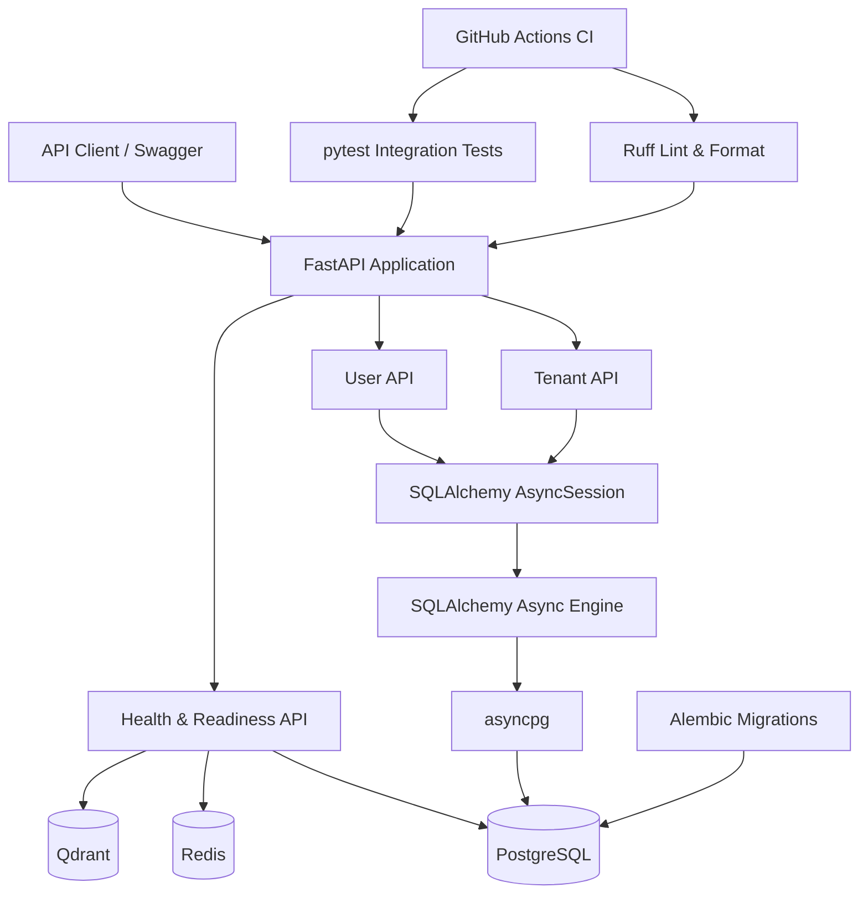
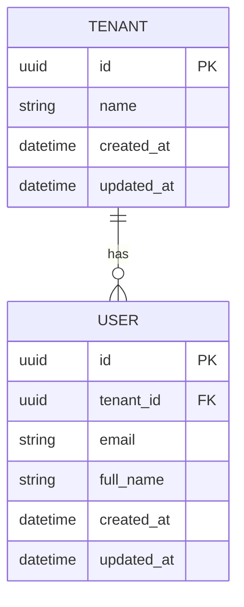
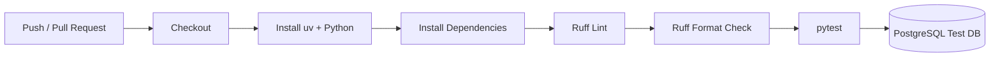
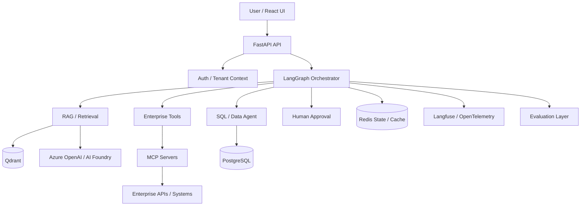

# Architecture

## Current Architecture — Sprint 0

The current implementation establishes the backend and infrastructure foundation for the platform.



## Request Path

A normal database-backed API request currently follows this path:

```text
HTTP Request
    ↓
FastAPI Route
    ↓
Pydantic Validation
    ↓
FastAPI Dependency Injection
    ↓
SQLAlchemy AsyncSession
    ↓
SQLAlchemy Async Engine
    ↓
asyncpg
    ↓
PostgreSQL
```

`AsyncSession` is created per request through the `get_db` FastAPI dependency.

The SQLAlchemy engine manages the database connectivity layer while `asyncpg` is the underlying asynchronous PostgreSQL driver.

## Multi-Tenant Data Model



The relationship is enforced at the database level:

```text
users.tenant_id → tenants.id
```

Deleting a tenant cascades to its users through:

```text
ON DELETE CASCADE
```

User email uniqueness is tenant-scoped:

```text
UNIQUE (tenant_id, email)
```

Therefore, the same email can belong to users in different tenants while duplicate users inside the same tenant are rejected.

## Tenant Isolation

Current API queries for tenant-owned users explicitly filter by `tenant_id`.

Conceptually:

```text
Tenant A
 ├── User A1
 └── User A2

Tenant B
 └── User B1
```

A request to list users for Tenant A must only return A1 and A2.

This boundary will later be extended to:

- Documents
- Vector collections / payload filters
- Retrieval
- Agent state
- Tool permissions
- Audit events
- Authorization

## Infrastructure

Local infrastructure is orchestrated through Docker Compose.

### PostgreSQL

Current responsibility:

- Tenant data
- User data
- Relational application state

Future responsibility:

- Document metadata
- Agent metadata
- Audit and workflow records

### Redis

Currently provisioned and validated through the readiness endpoint.

Planned responsibilities:

- Caching
- Transient agent state
- Checkpoint support
- Rate limiting
- Distributed locks where required

### Qdrant

Currently provisioned and validated through the readiness endpoint.

Planned responsibilities:

- Embedding storage
- Tenant-scoped vector retrieval
- Metadata filtering
- Semantic search

Qdrant is infrastructure-ready, but RAG ingestion and retrieval are not yet implemented.

## Health Model

Two separate endpoints are used:

```text
GET /health
GET /ready
```

`/health` verifies that the application process is running.

`/ready` verifies critical infrastructure dependencies:

```text
PostgreSQL
Redis
Qdrant
```

If a required dependency is unavailable, readiness returns a non-ready response rather than reporting the service as ready.

## Database Migrations

Schema evolution is managed with Alembic.

Current migration history includes:

```text
create tenants table
        ↓
create users table
```

Alembic uses the same SQLAlchemy metadata as the application models and generates PostgreSQL schema migrations from model changes.

## Testing Architecture

Integration tests use a dedicated PostgreSQL database:

```text
agentic_ai_test
```

Test requests flow through the real FastAPI and SQLAlchemy stack:

```text
pytest
   ↓
HTTPX AsyncClient
   ↓
FastAPI
   ↓
SQLAlchemy AsyncSession
   ↓
asyncpg
   ↓
PostgreSQL test DB
```

The test engine uses `NullPool` so async database connections are not reused across independent pytest event loops.

Tests currently focus on critical foundation behavior rather than exhaustive coverage.

## CI Architecture

GitHub Actions executes the backend quality gate on pushes and pull requests.



A failed lint, format, or test step fails the workflow.

## Current Technology Stack

### Application

- Python 3.12
- FastAPI
- Pydantic

### Persistence

- SQLAlchemy 2 Async
- asyncpg
- PostgreSQL
- Alembic

### Infrastructure

- Docker Compose
- Redis
- Qdrant

### Quality

- pytest
- pytest-asyncio
- HTTPX
- Ruff
- GitHub Actions

## Planned Target Architecture

The following is the direction of the project, not the current implementation:



Planned components will only be marked as implemented after their corresponding sprint is completed.

## Architecture Principles

The project is designed around:

- Tenant isolation
- Explicit data ownership
- Async I/O
- Schema migrations
- Testability
- CI enforcement
- Observability
- Evaluation
- Secure tool execution
- Human approval for sensitive actions
- Reproducible local environments
