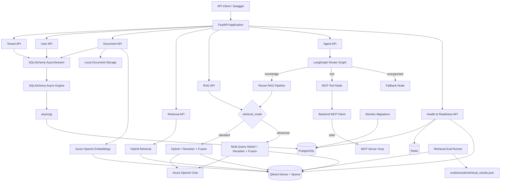
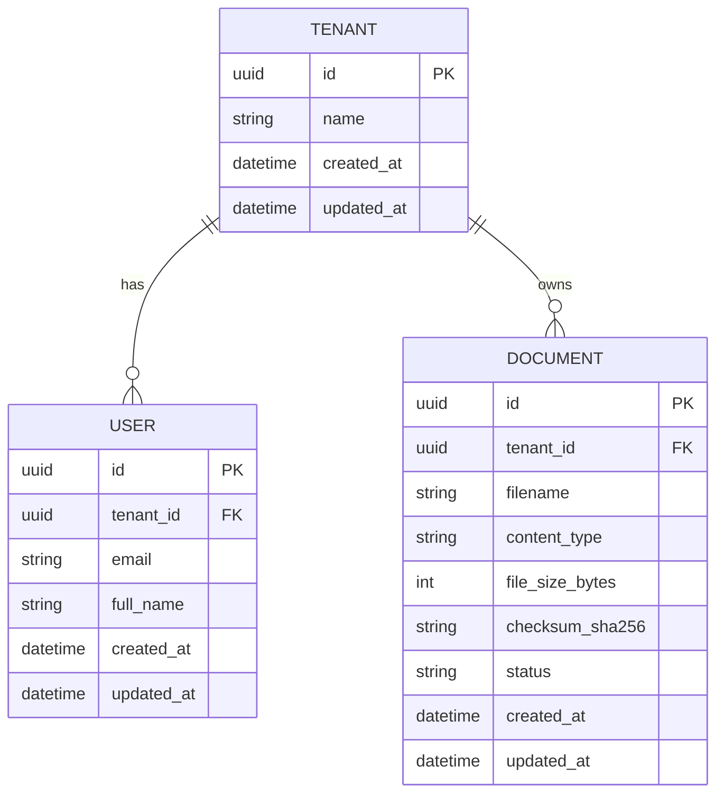
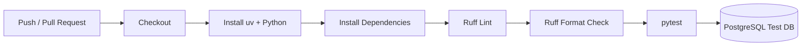
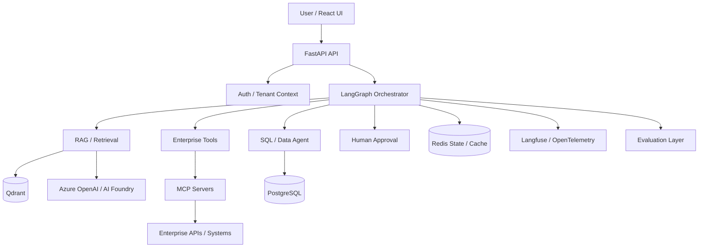

# Architecture

## Current Architecture — Sprint 0–4

The platform currently provides a multi-tenant FastAPI backend with document
ingestion, hybrid retrieval, reranking, multi-query RAG modes, retrieval
evaluation, and a **router-based LangGraph agent** with knowledge (RAG) and
tool (MCP) routes. SQL Agent, HITL/approval, write persistence to real
enterprise systems, conversation memory, and Langfuse remain planned.



## Request Path

A normal database-backed API request currently follows this path:

```text
HTTP Request
    ↓
FastAPI Route
    ↓
Pydantic Validation
    ↓
FastAPI Dependency Injection
    ↓
SQLAlchemy AsyncSession
    ↓
SQLAlchemy Async Engine
    ↓
asyncpg
    ↓
PostgreSQL
```

`AsyncSession` is created per request through the `get_db` FastAPI dependency.

## RAG Retrieval Paths

### Standard (default)

```text
Query
  ↓
Dense + Sparse Hybrid Retrieval
  ↓
Weighted RRF
  ↓
CrossEncoder Reranker
  ↓
Final Rank Fusion
  ↓
Top-K Chunks
  ↓
Azure OpenAI Chat
  ↓
Grounded Answer + Sources
```

### Advanced

```text
Query
  ↓
Query Expansion
  ↓
Multi-Query Hybrid Retrieval
  ↓
Multi-Query RRF + Deduplication
  ↓
CrossEncoder (original user query)
  ↓
Final Rank Fusion
  ↓
Top-K Chunks
  ↓
Azure OpenAI Chat
  ↓
Grounded Answer + Sources
```

CrossEncoder always receives the original user query. Expansion queries are used
only for candidate retrieval.

## Agent Orchestration (Sprint 3–4)

The agent layer is a **router-based LangGraph graph**, not a full multi-agent
supervisor. RAG and MCP tools are invoked as capabilities; retrieval/generation
and MCP protocol details are not reimplemented as REST APIs inside the graph.

### Implemented graph

```text
START
  ↓
LLM Router
  ├── knowledge → RAG Node → Finalize → END
  ├── tool → MCP Tool Node → Finalize → END
  └── unsupported → Fallback → END
```

### Routing responsibilities

1. The **LLM Router** selects the capability category:
   - `knowledge` — enterprise documents / knowledge base
   - `tool` — current operational data or enterprise tool actions via MCP
   - `unsupported` — capabilities not currently available
2. On the `tool` path, the **MCP Tool Node's LLM** selects the specific MCP tool
   using schemas discovered from the MCP server.
3. **MCP itself does not create REST endpoints.** Tools are exposed over the
   MCP protocol; the only HTTP surface for agents remains
   `POST /api/v1/tenants/{tenant_id}/agent`.

### Shared state

```text
AgentState
├── tenant_id
├── query
├── retrieval_mode   # standard | advanced
├── route            # knowledge | tool | unsupported
├── rag_answer
├── tool_answer
└── final_answer
```

### Request path

```text
POST /api/v1/tenants/{tenant_id}/agent
  ↓
Validate tenant + payload
  ↓
agent_graph.ainvoke({ tenant_id, query, retrieval_mode })
  ↓
{ route, answer }
```

Failure handling:

- invalid `retrieval_mode` → HTTP 422
- graph execution exception → HTTP 503 (`Agent execution failed.`)

## MCP & Enterprise Tool Integration (Sprint 4)

### Separate MCP server project

The MCP server lives under `/mcp` as its own `uv` project
(`enterprise-maintenance-mcp`). It is not part of the FastAPI process.

Current local integration uses **stdio** transport:

```text
Backend MCP client
  ↓
stdio (uv run python server.py, cwd=/mcp)
  ↓
MCP server process
```

### Backend MCP client

`backend/app/services/mcp_client.py`:

- Opens a stdio session to the MCP server
- Discovers tools via `list_tools()`
- Executes tools via `call_tool(name, arguments)`
- Consumes structured tool outputs (`structured_content`)

### Tool-calling loop (MCP Tool Node)

```text
User request (tool route)
  ↓
list_tools() → bind MCP schemas to chat model
  ↓
LLM tool selection
  ↓
call_tool() → MCP execution
  ↓
ToolMessage (structured result as JSON)
  ↓
LLM final answer → tool_answer → Finalize
```

### Implemented MCP tools

| Tool | Behavior |
|------|----------|
| `get_asset_status` | Returns operational status from in-memory demo data |
| `get_maintenance_history` | Returns maintenance history from in-memory demo data |
| `create_maintenance_ticket` | **Simulated write/action tool** — returns a ticket payload; does **not** persist to a database or call an external enterprise API |

### What is intentionally not implemented yet

- Write persistence for action tools (DB or real enterprise API)
- Human-in-the-loop / approval before sensitive actions
- SQL agent and SQL security controls
- JWT / RBAC / authenticated tenant context
- Real external enterprise system integration beyond local MCP demo data
- Multi-agent supervisor orchestration
- Conversation memory / checkpoint persistence
- Langfuse / full observability traces
- Automatic retry policies

## Multi-Tenant Data Model



User email uniqueness is tenant-scoped:

```text
UNIQUE (tenant_id, email)
```

## Tenant Isolation

Documents, retrieval, and RAG are tenant-scoped.

Qdrant queries always include a `tenant_id` payload filter. Optional metadata
filters (`document_id`, `filename`) compose with that tenant boundary.

Conceptually:

```text
Tenant A
 ├── Documents A*
 └── Chunks A*

Tenant B
 ├── Documents B*
 └── Chunks B*
```

A request for Tenant A must never return Tenant B chunks.

## Infrastructure

Local infrastructure is orchestrated through Docker Compose.

### PostgreSQL

Current responsibility:

- Tenant data
- User data
- Document metadata
- Relational application state

### Redis

Currently provisioned and validated through the readiness endpoint.

Planned responsibilities (not yet implemented):

- Caching
- Transient agent state
- Checkpoint support
- Rate limiting

### Qdrant

Current responsibility:

- Dense embeddings
- Sparse BM25 vectors
- Tenant-scoped hybrid retrieval
- Metadata filtering

Qdrant remains a retrieval index, not the primary application database.

### MCP server (`/mcp`)

Current responsibility:

- Local stdio MCP server for maintenance demo tools
- Structured tool schemas and outputs
- In-memory / simulated operational data for Sprint 4 demos

## Health Model

```text
GET /health
GET /ready
```

`/health` verifies that the application process is running.

`/ready` verifies critical infrastructure dependencies:

```text
PostgreSQL
Redis
Qdrant
```

## Database Migrations

Schema evolution is managed with Alembic.

Current migration history includes:

```text
create tenants table
        ↓
create users table
        ↓
create documents table
```

## Testing Architecture

Integration tests use a dedicated PostgreSQL database:

```text
agentic_ai_test
```

18 tests currently pass (`cd backend && uv run pytest -q`).

Retrieval evaluation is separate from unit/integration tests:

```text
evals/datasets/retrieval_golden.jsonl
        ↓
evals/retrieval/run_evaluation.py
        ↓
evals/results/retrieval_results.json
```

The golden set is intentionally small and is a reproducible Sprint 2 artifact,
not a large-scale production benchmark.

Critical agent API tests cover graph result mapping for `knowledge`, `tool`,
and `unsupported`, invalid `retrieval_mode` validation (422), and controlled
graph failure handling (503).

## CI Architecture

GitHub Actions executes the backend quality gate on pushes and pull requests.



## Current Technology Stack

### Application

- Python 3.12
- FastAPI
- Pydantic
- LangChain text splitters / Azure OpenAI integrations
- LangGraph (router-based agent orchestration)
- MCP Python SDK (stdio client + separate `/mcp` server)

### Persistence & Retrieval

- SQLAlchemy 2 Async
- asyncpg
- PostgreSQL
- Alembic
- Qdrant (dense + sparse)
- FastEmbed BM25
- CrossEncoder reranker

### Infrastructure

- Docker Compose
- Redis
- Azure OpenAI
- Local MCP server under `/mcp` (stdio)

### Quality

- pytest
- pytest-asyncio
- HTTPX
- Ruff
- GitHub Actions
- Retrieval evaluation under `evals/`

## Planned Target Architecture

The following remains the longer-term direction. Sprints 3–4 deliver the
router-based LangGraph entrypoint with RAG and **local stdio MCP tools**.
Supervisor-style multi-agent flows, SQL agent, HITL, real enterprise write
persistence, and observability expansion are **not** current implementation:



Planned components such as HITL, JWT/RBAC, SQL security, React UI, cloud
deployment, and supervisor-style agent expansion will only be marked as
implemented after their corresponding sprint is completed.

## Architecture Principles

The project is designed around:

- Tenant isolation
- Explicit data ownership
- Async I/O
- Schema migrations
- Testability
- CI enforcement
- Measurable retrieval quality
- Controlled tool execution via MCP (local stdio today)
- Observability (planned expansion)
- Human approval for sensitive actions (planned)
- Reproducible local environments
